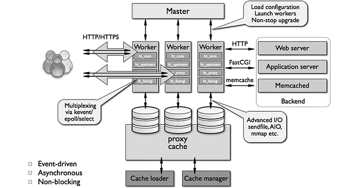
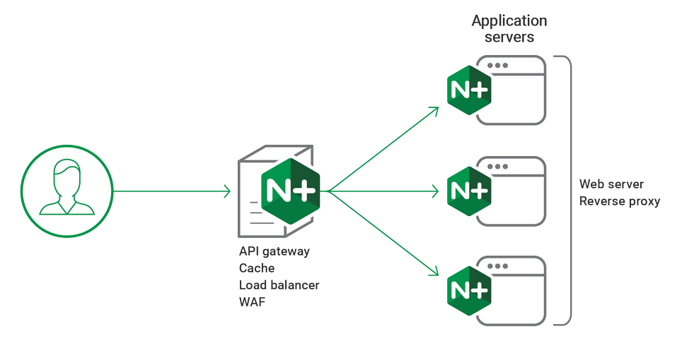
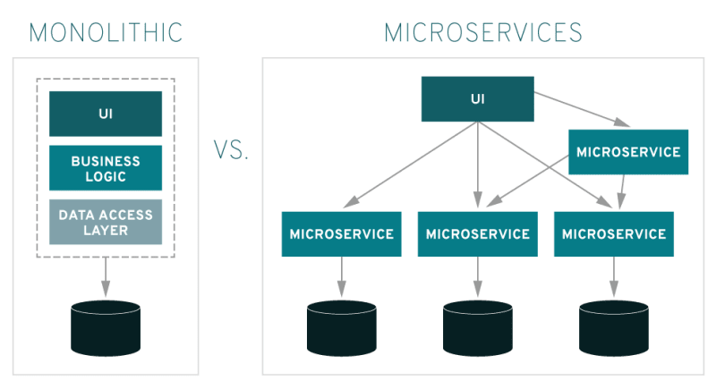

# AULA NGINX

## Conhecimentos básicos

### Introdução nginx

O Nginx (pronunciado "engine-x") é um servidor web e servidor proxy reverso de alto desempenho, projetado para atender solicitações da web e atuar como intermediário entre os clientes e os servidores backend. É conhecido por sua eficiência e capacidade de lidar com uma grande quantidade de solicitações simultaneamente, tornando-o uma escolha popular para servidores web e servidores proxy em todo o mundo.

Aqui estão alguns aspectos importantes a serem considerados ao introduzir o Nginx:

Processos no Nginx:

`Processo Master`: O Nginx inicia um único processo principal (processo master) que controla a configuração e a inicialização dos processos de trabalho.

`Processos de Trabalho (Worker Processes)`: O Nginx cria vários processos de trabalho para lidar com as solicitações dos clientes. Cada processo de trabalho é responsável por atender a um conjunto de solicitações, e isso permite que o Nginx seja altamente eficiente e escalável.

Principais Diferenças entre o Nginx e o Apache:

* Arquitetura de Processos:

    `Nginx`: Usa uma arquitetura de processos assíncronos e não bloqueantes, o que permite que um único processo de trabalho atenda a várias solicitações simultaneamente. Isso é eficiente e adequado para cargas de trabalho com muitas conexões concorrentes.
    `Apache`: Usa uma abordagem baseada em processos e threads, onde cada solicitação é tratada por um novo processo ou thread. Isso pode ser mais pesado em termos de consumo de recursos.
    Consumo de Recursos:

    `Nginx`: Geralmente, consome menos recursos de sistema em comparação com o Apache, tornando-o uma escolha popular para servidores de alto tráfego.
    `Apache`: Pode ser mais pesado em termos de uso de CPU e memória, especialmente quando há muitas solicitações simultâneas.

* Concorrência e Escalabilidade:

    `Nginx`: É altamente escalável e é conhecido por seu bom desempenho em situações de alta concorrência. É uma escolha popular para servidores web que precisam lidar com muitas conexões simultâneas.
    `Apache`: Pode ser menos eficiente em situações de alta concorrência devido à abordagem baseada em processos e threads.

* Configuração:

    `Nginx`: Possui uma sintaxe de configuração mais simples e direta, o que torna a configuração mais clara e legível.
    `Apache`: Possui uma configuração mais complexa e com mais opções, o que pode ser vantajoso em ambientes complexos, mas pode ser mais desafiador de configurar e manter.



### Proxy reverso

**Proxy Reverso no Nginx:**

Um proxy reverso é um servidor intermediário que atua em nome de outros servidores ou recursos de backend para atender às solicitações dos clientes. No contexto do Nginx, um proxy reverso é uma das funcionalidades mais poderosas, permitindo que o Nginx encaminhe solicitações para servidores backend com base em vários critérios. O proxy reverso é amplamente utilizado para várias finalidades, incluindo balanceamento de carga, cache, segurança e muito mais.

**Para que serve o proxy reverso no Nginx:**

1. **Balanceamento de Carga:** Um dos usos mais comuns do proxy reverso é distribuir o tráfego entre vários servidores backend. Isso melhora o desempenho, a escalabilidade e a confiabilidade de um sistema, garantindo que as solicitações sejam atendidas por servidores disponíveis.

2. **Cache de Conteúdo:** O Nginx pode atuar como um proxy reverso para armazenar em cache conteúdo estático ou dinâmico. Isso reduz a carga nos servidores backend e acelera a entrega de conteúdo para os clientes.

3. **Segurança e Anonimato:** O proxy reverso no Nginx pode ocultar a infraestrutura de backend dos clientes, melhorando a segurança. Além disso, ele pode ser usado para fornecer anonimato na internet, mascarando o endereço IP real do cliente.

4. **SSL Offloading:** O Nginx pode ser usado como um proxy reverso para gerenciar o SSL/TLS, descriptografando o tráfego criptografado antes de atingir os servidores backend. Isso alivia a carga computacional dos servidores de aplicativos.

5. **Proteção contra Ataques DDoS:** O proxy reverso pode ser configurado para filtrar e bloquear tráfego malicioso, ajudando a proteger os servidores de aplicativos contra ataques de negação de serviço distribuído (DDoS).

**Exemplos de Uso do Proxy Reverso no Nginx:**

1. **Balanceamento de Carga:** Configurar um proxy reverso para distribuir solicitações entre vários servidores web (exemplo: Apache, Node.js) para melhorar o desempenho e a disponibilidade.

2. **Cache de Conteúdo:** Usar o Nginx para armazenar em cache imagens, vídeos ou páginas da web dinâmicas para reduzir o tempo de carregamento e economizar largura de banda.

3. **Segurança:** Configurar o Nginx como um proxy reverso para esconder os servidores de aplicativos reais e protegê-los contra ataques diretos, como SQL injection ou injeção de scripts maliciosos.

4. **Proxy Reverso com SSL Offloading:** Usar o Nginx para gerenciar o SSL/TLS, descriptografando o tráfego criptografado antes de atingir os servidores backend.

5. **API Gateway:** Configurar o Nginx como um proxy reverso para rotear solicitações de API para diferentes serviços de backend, aplicando autenticação, autorização e controle de tráfego.

6. **Serviços de Email:** Usar o Nginx como um proxy reverso para encaminhar solicitações de serviços de email (por exemplo, Exchange, SMTP) para servidores de email internos.

O proxy reverso no Nginx é uma ferramenta versátil e poderosa que desempenha um papel crucial na otimização, segurança e escalabilidade de infraestruturas web e de aplicativos. Sua flexibilidade o torna adequado para uma ampla gama de cenários e casos de uso.



### Monolítico x Microserviço
`Monolithic (Monolítica)`: é nada mais e nada menos do que uma arquitetura para uma aplicação rodando em somente um serviço contendo uma estrutura com poucas seções de maneira estruturada para o servidor;

`Microserviços (Microservices)`: é nada mais é do que uma arquitetura com muitos micro (pequenos) serviços rodando em uma ou várias aplicações, ideal para projetos de grande porte e com diversas áreas diferentes.



## Instalaçao ubuntu e comandos

Principais arquivos no ubuntu:

```bash
/usr/share/nginx/html # diretório padrão dos arquivos estáticos
/etc/nginx/nginx.conf # arquivo de configuração do nginx
```

Alguns comandos:

```bash
$ sudo apt install nginx #Comando de instalação
$ nginx -h #Opção de ajuda do nginx
$ sudo systemctl status nginx #Verifica os status do processo
$ sudo nginx -s stop #Encerra processo do nginx
```

## No Docker

### Configurações simples

```bash
docker run --name nginx -v /data/html/html/:/usr/share/nginx/html -v /data/conf/nginx.conf:/etc/nginx/nginx.conf -p 80:80 -d nginx
```
### Com mais de um server

```bash
docker run --name nginx_servers -v /data/html/loja/:/usr/share/nginx/loja -v /data/html/blog/:/usr/share/nginx/blog -v /data/conf/nginx_dois_servers.conf:/etc/nginx/nginx.conf -p 9090:9090 -p 8080:8080 -d nginx
```

### Com dois paths

```bash
docker run --name nginx -v /data/html/:/usr/share/nginx/ -v /data/conf/nginx_dois_paths.conf:/etc/nginx/nginx.conf -p 80:80 -d nginx
```

### Proxy Pass

```bash
docker run --name router_pass -v /data/conf/nginx_proxy_pass.conf:/etc/nginx/nginx.conf -p 80:80 -d nginx
```

### Load Bacalncer
```bash
docker run --name router_load -v /data/conf/nginx_load_balance.conf:/etc/nginx/nginx.conf -p 80:80 -d nginx
```
### Principais componentes do arquivo nginx.conf

`worker_processes`: Define o número de processos de trabalho (workers) que o Nginx utilizará para manipular solicitações. Neste exemplo, está configurado com apenas um processo.

`events`: Especifica configurações relacionadas ao modelo de eventos do Nginx, que controla a maneira como o servidor lida com conexões e solicitações.

`worker_connections`: Define o número máximo de conexões simultâneas que um único processo de trabalho pode tratar. Neste caso, é definido como 1024.

`http`: Define as configurações gerais do servidor web HTTP.

`include mime.types`: Inclui um arquivo que define os tipos MIME para o servidor. Isso é importante para a definição dos tipos de conteúdo servidos.

`default_type`: Define o tipo MIME padrão que será enviado para o navegador se não for especificado em uma resposta HTTP. Neste caso, é application/octet-stream.

`sendfile`: Ativa o uso da função de envio de arquivos do sistema operacional para entregar arquivos estáticos de maneira mais eficiente.

`keepalive_timeout`: Define o tempo máximo que uma conexão pode permanecer aberta em segundos. Após esse período de inatividade, a conexão será encerrada.

`server`: Define as configurações para um servidor virtual (server block).

`listen 80`: Especifica a porta na qual o servidor deve escutar. Neste caso, ele escuta na porta 80, que é a porta padrão para solicitações HTTP.

`server_name localhost`: Define o nome do servidor, que é usado para determinar qual servidor virtual deve manipular uma solicitação com base no nome do host na solicitação.

`location /`: Define as configurações para uma localização específica. Neste caso, é a raiz do servidor.

`root /usr/share/nginx/html`: Especifica o diretório raiz onde os arquivos estão localizados.

`index index.html`: Define o arquivo padrão a ser servido quando um diretório é acessado. Neste caso, index.html.

### ATIVIDADE

1 - Execute o exemplo "Configuracoes simples" e tente acessar a pagina padrao do NGINX

2 - No exemplo "Com dois paths", customize as paginas com tags HTML e crie algo personalizado. Fique a vontade de criar novos paths, caso deseje.

3 - Crie dois containers, denominados "ifood" e "uber", configurados para operar nas portas 2030 e 2040, respectivamente. Implemente um servidor proxy reverso para direcionar o tráfego para esses containers. Personalize as páginas HTML dos containers e disponibilize o acesso a eles por meio da porta 80 do servidor proxy reverso.

